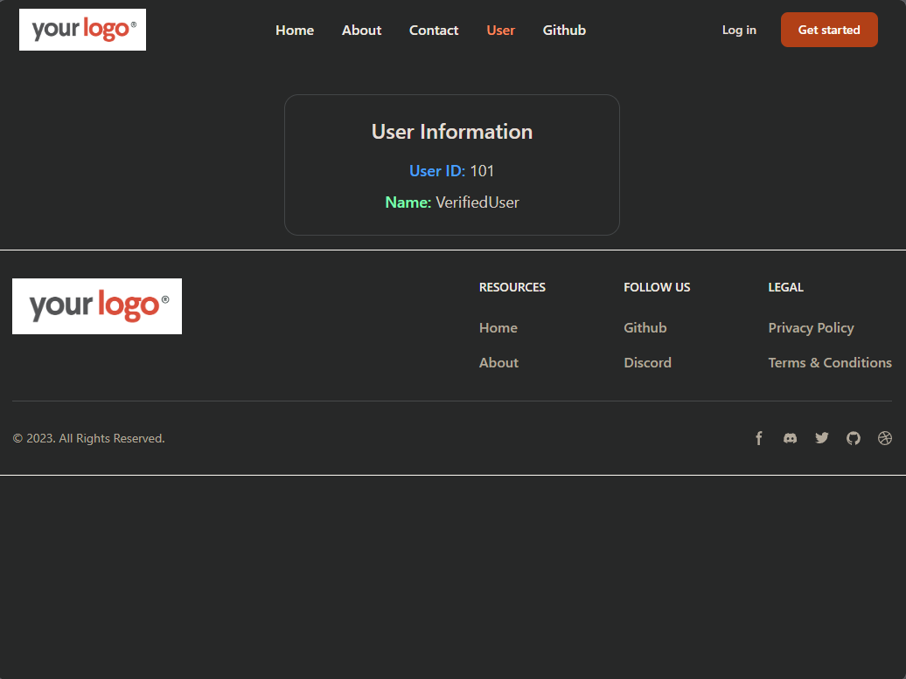

# React Router Project

This project is a **React + Vite** based demo of routing using React Router.  
It showcases how to use multiple routes, navigation, and route-based components in a React application styled with **Tailwind CSS**.

---

## 🌐 Live Demo

👉 **Preview:**  
👉 https://react-router-chai.vercel.app/

---

## 📸 Screenshots

### Home Page

### About Page

### Contact Us

### User Page

---

## 🚀 Features

- Multiple pages/routes (Home, About, Contact, etc) using React Router  
- Navigation menu for switching between routes  
- Tailwind CSS styling for responsive and clean UI  
- React Hooks (e.g., `useState`, `useEffect`) used in components  
- Clean project setup with **Vite** for fast development

---

## 🛠️ Tech Stack

| Technology        | Purpose                                   |
|-------------------|-------------------------------------------|
| React             | Front-end JavaScript library              |
| Vite              | Build tool & dev server                   |
| React Router      | Client-side routing for React             |
| Tailwind CSS      | Utility-first CSS framework               |
| JSX / React Hooks | Component logic and state management      |
| Hosting           | Vercel                                    |

---

## 📋 Getting Started

### Prerequisites  
- Node.js (v14+ recommended)  
- npm or yarn

### Installation  
    git clone https://github.com/TasinTausif/react-router.git
    cd react-router
    npm install

### Running the app
    npm run dev

Open your browser and go to the URL shown in the terminal ( http://localhost:5173).

## 🎮 How to Use

Use the navigation links in the header to move between pages.

Each route renders a different component (e.g., Home, About).

Observe how the browser’s URL changes and the page content updates without a full page refresh (client-side routing).
